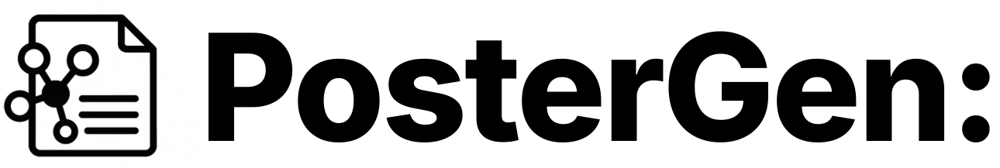
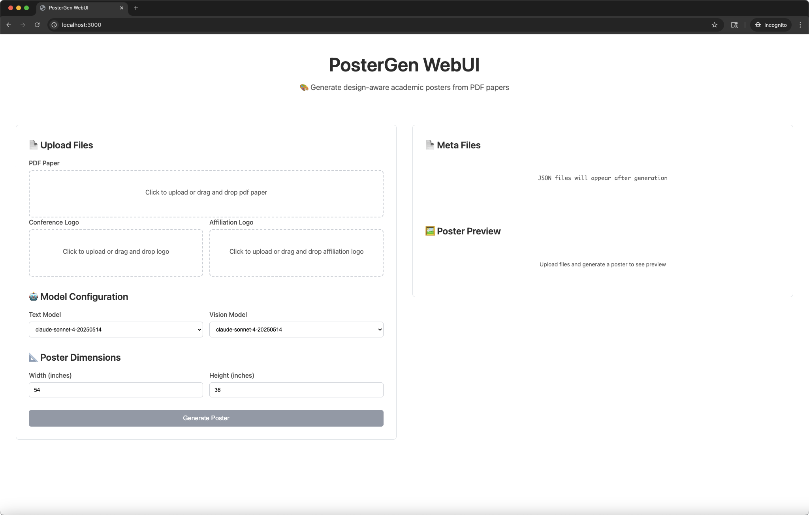
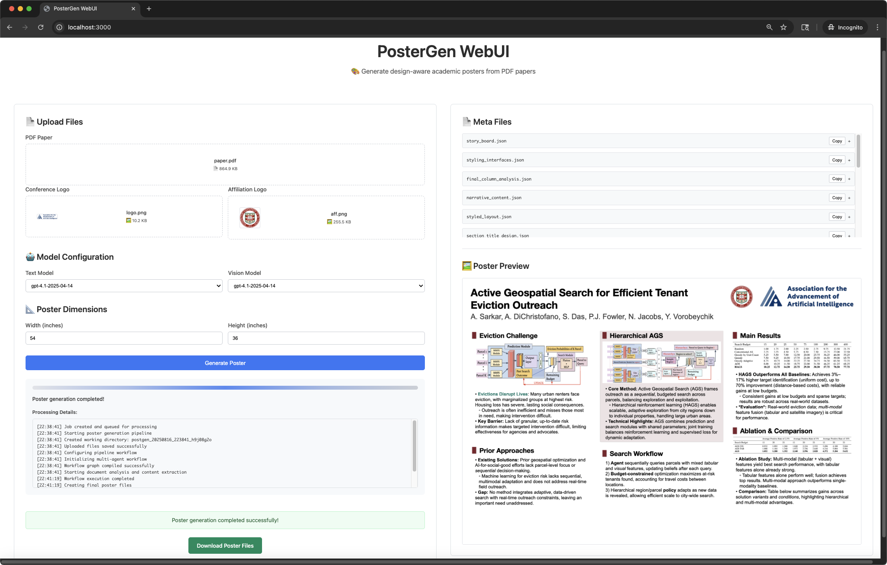

<div align="center">
  
  

  <h2>PosterGen: Aesthetic-Aware Paper-to-Poster Generation via <br> Multi-Agent LLMs</h2>
  <!-- <h4>🌟 🌟</h4> -->
  
  <br>
  
  <p>
    <a href="https://hadlay-zhang.github.io">Zhilin Zhang</a><sup>1,2 ★</sup>&nbsp;
    <a href="https://wyattz23.github.io">Xiang Zhang</a><sup>3 ★</sup>&nbsp;
    <a href="https://upup-wei.github.io/">Jiaqi Wei</a><sup>4</sup>&nbsp;
    <a href="https://Y-Research-SBU.github.io/PosterGen">Yiwei Xu</a><sup>5</sup>&nbsp;
    <a href="https://chenyuyou.me/">Chenyu You</a><sup>1</sup>
  </p>

  <p>
    <sup>1</sup> Stony Brook University &nbsp;&nbsp; 
    <sup>2</sup> New York University &nbsp;&nbsp;
    <sup>3</sup> University of British Columbia &nbsp;&nbsp; <br>
    <sup>4</sup> Zhejiang University &nbsp;&nbsp; 
    <sup>5</sup> University of California, Los Angeles &nbsp;&nbsp; 
    <sup>★</sup> Equal Contribution <br>
  </p>

<p align="center">
  <a href="https://arxiv.org/abs/2508.17188">
    
  </a>
  <a href="https://Y-Research-SBU.github.io/PosterGen">
    
  </a>
  <a href="https://huggingface.co/spaces/Y-Research-Group/PosterGen">
    
  </a>
  <a href="#">
    
  </a>
  <br>
  <a href="https://github.com/Y-Research-SBU/PosterGen/issues/1">
    
  </a>
  <a href="https://discord.gg/44pKs6b3">
    
  </a>
</p>

</div>

## Abstract

> In this work, we propose a multi-agent LLMs framework that is guided by design principles.  
> Our multi-agent LLMs adopt a workflow of specialist agents that mirrors a professional design process:
>
> - **Parser Agent** – extracts and structures all content from the source paper.  
> - **Curator Agent** – designs a narrative-based storyboard.  
> - **Layout Agent** – transforms the storyboard into a spatially balanced, three-column layout.  
> - **Styling Agents** – apply a harmonious color palette and a hierarchical typographic system to ensure aesthetic coherence.  
>
> This methodology is designed to generate a well-designed poster that minimizes the need for manual fine-tuning.


## 📢 News

- **2025.08.26** Our paper is now available on [arXiv](https://arxiv.org/abs/2508.17188)! 📄
- **2025.08.23** Code Released. PosterGen now available! 🎉🎉

## 🚀 Quick Start

### System Requirements
- **Operating System**: Windows, Linux, or macOS
- **Python Version**: 3.11

### 1. Environment Setup

#### Option 1: [UV](https://docs.astral.sh/uv/getting-started/installation/) (Recommended)

```bash
git clone -b main https://github.com/Y-Research-SBU/PosterGen.git
cd PosterGen

uv sync
```

#### Option 2: Conda

```bash
# Create and activate conda environment
conda create -n poster python=3.11 -y
conda activate poster

git clone -b main https://github.com/Y-Research-SBU/PosterGen.git
cd PosterGen

pip install -r requirements.txt
```

### 2. Install LibreOffice

**Windows:**
1. Download and install LibreOffice from [official website](https://www.libreoffice.org/download/download/)
2. Add LibreOffice to your system PATH:
   - Default installation: Add `C:\Program Files\LibreOffice\program` to PATH
   - Or custom installation: Add `<your_install_path>\LibreOffice\program` to PATH

**macOS:**
```bash
brew install --cask libreoffice
```

**Ubuntu/Linux:**
```bash
sudo apt install libreoffice
# Or using snap:
sudo snap install libreoffice
```

### 3. API Keys Configuration

Create a `.env` file in the project root with your API keys:

```bash
OPENAI_API_KEY="your_openai_key"
ANTHROPIC_API_KEY="your_anthropic_key"
ZHIPU_API_KEY="your_zhipu_key"
```

To use a compatible API service or a custom deployment, set the base URL in your `.env` file:

```bash
OPENAI_BASE_URL="https://your-api-endpoint.com/v1"
ANTHROPIC_BASE_URL="https://your-anthropic-endpoint.com"
GOOGLE_BASE_URL="https://your-google-endpoint.com"
ZHIPU_BASE_URL="https://your-zhipu-endpoint.com"
```

## Data Structure Setup

Before running the multi-agent pipeline, organize your files in the `data/` folder:

```
data/
└── <your_paper_name>/
    ├── paper.pdf          # Your research paper (required)
    ├── aff.png           # Affiliation logo for color extraction (required)
    └── logo.png          # Conference logo for poster (required)
```

**Examples (check `data/` folder):**
```
data/
└── Neural_Encoding_and_Decoding_at_Scale/
    ├── paper.pdf
    ├── aff.png
    └── logo.png
└── ...
```

## 🎯 Usage

### Command-line Interface

Generate your poster with a single command:

**For UV setup:**
```bash
uv run python -m src.workflow.pipeline \
  --poster_width 54 --poster_height 36 \
  --paper_path ./data/Your_Paper_Name/paper.pdf \
  --text_model gpt-4.1-2025-04-14 \
  --vision_model gpt-4.1-2025-04-14 \
  --logo ./data/Your_Paper_Name/logo.png \
  --aff_logo ./data/Your_Paper_Name/aff.png
```

**For Conda setup:**
```bash
python -m src.workflow.pipeline \
  --poster_width 54 --poster_height 36 \
  --paper_path ./data/Your_Paper_Name/paper.pdf \
  --text_model gpt-4.1-2025-04-14 \
  --vision_model gpt-4.1-2025-04-14 \
  --logo ./data/Your_Paper_Name/logo.png \
  --aff_logo ./data/Your_Paper_Name/aff.png
```

**Parameters:**
- `--poster_width/height`: Poster dimensions in inches, with aspect ratio (w/h): lower bound 1.4 (ISO A paper size), upper bound 2 (human vision limit)
- `--paper_path`: Path to your PDF paper
- `--text_model`: LLM for text processing (options: "gpt-4.1-2025-04-14" (default), "gpt-4o-2024-08-06", "gpt-4.1-mini-2025-04-14", "claude-sonnet-4-20250514")
- `--vision_model`: Vision model for analysis (same options as text_model)
- `--logo`: Conference logo
- `--aff_logo`: Affiliation logo (used for color scheme extraction)

### Web Interface

> Developed by: React + TypeScript + Vite

Upload your PDF paper and logos through drag-and-drop, configure models and dimensions, then generate and download your poster files.

**Prerequisites:**
- Node.js installed
- Main PosterGen dependencies installed (from project root)
- API keys configured in `.env` file

```bash
# Install main project dependencies (if not done already, refer to Environment Setup above)

# Start backend
cd webui && python start_backend.py

# Start frontend (in new terminal, from project root)
cd webui && sh ./start_frontend.sh

# Open http://localhost:3000 in your browser
```





## ☁️ Deploy to Google Cloud Run

This repository includes a FastAPI backend (see `src/workflow/pipeline.py`) and a production-ready Dockerfile. You can deploy it to Cloud Run either with the provided `cloudbuild.yaml` or directly from your local machine.

### Prerequisites
- Google Cloud project with billing enabled
- Google Cloud CLI installed and initialized
- APIs enabled: Cloud Run Admin API, Cloud Build API, Secret Manager API, Cloud Storage API
- GCS buckets created for input and output PDFs

```powershell
# Set your project
$project = "YOUR_PROJECT_ID"
gcloud config set project $project

# Enable required APIs
gcloud services enable run.googleapis.com cloudbuild.googleapis.com secretmanager.googleapis.com storage.googleapis.com
```

### 1) Create secrets in Secret Manager
PosterGen reads API keys from Secret Manager when `GCP_PROJECT_ID` is set. At minimum, create `OPENAI_API_KEY`. You can also add `ANTHROPIC_API_KEY`, `GOOGLE_API_KEY`, `ZHIPU_API_KEY` as needed by the models you choose.

```powershell
# Create a secret (first time)
# (Replace the value with your real key)
$env:OPENAI_API_KEY = "sk-your-openai-key"
echo $env:OPENAI_API_KEY | gcloud secrets create OPENAI_API_KEY --data-file=-

# If the secret already exists, add a new version instead:
# echo $env:OPENAI_API_KEY | gcloud secrets versions add OPENAI_API_KEY --data-file=-
```

### 2) Grant IAM to the Cloud Run service account
Cloud Run needs permission to access Secret Manager and your GCS buckets. By default, Cloud Run runs as the Compute Engine default service account.

```powershell
# Resolve default service account for the project
$projectNumber = (gcloud projects describe $project --format 'value(projectNumber)')
$sa = "$projectNumber-compute@developer.gserviceaccount.com"

# Allow reading secrets
gcloud projects add-iam-policy-binding $project `
  --member="serviceAccount:$sa" `
  --role="roles/secretmanager.secretAccessor"

# Allow reading your input bucket and writing to your output bucket
# Replace these with your bucket names
$inputBucket = "gs://YOUR_INPUT_BUCKET"
$outputBucket = "gs://YOUR_OUTPUT_BUCKET"

gcloud storage buckets add-iam-policy-binding $inputBucket `
  --member="serviceAccount:$sa" `
  --role="roles/storage.objectViewer"

gcloud storage buckets add-iam-policy-binding $outputBucket `
  --member="serviceAccount:$sa" `
  --role="roles/storage.objectAdmin"
```

### 3A) Deploy with Cloud Build (using cloudbuild.yaml)
The included `cloudbuild.yaml` builds, pushes, and deploys to Cloud Run with sensible defaults (16Gi memory, 4 CPU, 60-minute timeout) and injects `OPENAI_API_KEY` from Secret Manager.

```powershell
# Optional: edit cloudbuild.yaml to set your preferred region (default: us-east4)
# Then run:
cd PosterGenApp
gcloud builds submit --config cloudbuild.yaml
```

This will create a service named `postergen-backend`. After the build completes, note the service URL from the Cloud Run console.

If the service needs the project ID at runtime, set the environment variable on the service after deployment:

```powershell
# Set GCP_PROJECT_ID for the running service (so the app can locate secrets)
gcloud run services update postergen-backend `
  --region us-east4 `
  --set-env-vars GCP_PROJECT_ID=$project
```

### 3B) Deploy directly (without Cloud Build)
Alternatively, build and deploy in two steps:

```powershell
# Build and push the image to gcr.io
cd PosterGenApp
gcloud builds submit --tag gcr.io/$project/postergen-backend

# Deploy to Cloud Run (adjust region if needed)
gcloud run deploy postergen-backend `
  --image gcr.io/$project/postergen-backend `
  --region us-east4 `
  --allow-unauthenticated `
  --memory=16Gi `
  --cpu=4 `
  --timeout=3600 `
  --set-secrets=OPENAI_API_KEY=OPENAI_API_KEY:latest `
  --set-env-vars=GCP_PROJECT_ID=$project
```

Notes:
- Use `--no-allow-unauthenticated` to make the service private (see Auth below).
- If you use other providers, also inject their keys via `--set-secrets` and grant `secretAccessor`.

### Auth: public vs private
- Public service: leave `--allow-unauthenticated` (or enable public access in the console). This is simplest for testing.
- Private service: deploy with `--no-allow-unauthenticated` and call with an ID token.

```powershell
# Example: call a private service using an ID token
$SERVICE_URL = "https://<your-cloud-run-host>"  # no trailing slash
$TOKEN = (gcloud auth print-identity-token)

$body = @{ 
  gcs_input_bucket = "YOUR_INPUT_BUCKET";
  gcs_output_bucket = "YOUR_OUTPUT_BUCKET";
  pdf_path = "your_paper_name/paper.pdf";
  logo = "your_paper_name/logo.png";
  aff_logo = "your_paper_name/aff.png";
  width = 54; height = 36
} | ConvertTo-Json

Invoke-RestMethod -Method Post -Uri "$SERVICE_URL/generate-poster/" `
  -Headers @{ Authorization = "Bearer $TOKEN" } `
  -ContentType 'application/json' `
  -Body $body
```

## 🔌 HTTP API: `/generate-poster/`

FastAPI exposes a JSON API for end-to-end poster generation orchestrated by LangGraph. The service reads the paper and logos from your input GCS bucket, runs the multi-agent pipeline, then writes the final `.pptx` to your output GCS bucket.

- Method: POST
- Path: `/generate-poster/`
- Auth: Public if service allows unauthenticated; otherwise send an ID token
- Content-Type: `application/json`

### Request body
```json
{
  "gcs_input_bucket": "<INPUT_BUCKET>",
  "gcs_output_bucket": "<OUTPUT_BUCKET>",
  "pdf_path": "<path/in/input/bucket/to/paper.pdf>",
  "logo": "<optional path/in/input/bucket/to/logo.png>",
  "aff_logo": "<optional path/in/input/bucket/to/aff.png>",
  "text_model": "gpt-5-2025-08-07",
  "multimodal_model": "gpt-5-2025-08-07",
  "image_model": "gpt-image-1",
  "fast_llm_model": "gpt-5-mini-2025-08-07",
  "fast_search": false,
  "output_path": "poster.pptx",
  "debug_mode": false,
  "width": 54,
  "height": 36,
  "url": "https://example.com/optional-qr-url"
}
```

Required fields:
- `gcs_input_bucket`, `gcs_output_bucket`, `pdf_path`

Dimensions:
- `width` and `height` are inches; the pipeline enforces a width/height ratio between 1.4 and 2.0.

Models:
- The defaults are provided. If you change providers, ensure the corresponding Secret Manager keys exist and are injected. The server also relies on `GCP_PROJECT_ID` to resolve secret access.

### Example requests

PowerShell (public service):
```powershell
$SERVICE_URL = "https://<your-cloud-run-host>"  # no trailing slash
$body = @{ 
  gcs_input_bucket = "YOUR_INPUT_BUCKET";
  gcs_output_bucket = "YOUR_OUTPUT_BUCKET";
  pdf_path = "your_paper_name/paper.pdf";
  logo = "your_paper_name/logo.png";
  aff_logo = "your_paper_name/aff.png";
  width = 54; height = 36
} | ConvertTo-Json

Invoke-RestMethod -Method Post -Uri "$SERVICE_URL/generate-poster/" `
  -ContentType 'application/json' `
  -Body $body
```

curl (public service):
```bash
curl -X POST "$SERVICE_URL/generate-poster/" \
  -H "Content-Type: application/json" \
  -d '{
    "gcs_input_bucket": "YOUR_INPUT_BUCKET",
    "gcs_output_bucket": "YOUR_OUTPUT_BUCKET",
    "pdf_path": "your_paper_name/paper.pdf",
    "logo": "your_paper_name/logo.png",
    "aff_logo": "your_paper_name/aff.png",
    "width": 54,
    "height": 36
  }'
```

### Response
```json
{
  "status": "success",
  "output_path": "gs://<OUTPUT_BUCKET>/<poster_name>.pptx"
}
```

On error, the API returns HTTP 500 with details in the `detail` field. Check Cloud Run logs for stack traces.

### Tips & Troubleshooting
- Ensure `GCP_PROJECT_ID` is set on the Cloud Run service if you rely on Secret Manager inside the app.
- Missing permissions commonly cause 500s: grant `secretAccessor` and Storage roles to the service account.
- Set generous limits for long papers: `--memory=16Gi --cpu=4 --timeout=3600` (already present in `cloudbuild.yaml`).
- Explore interactive docs at `https://<service>/docs` (FastAPI Swagger UI) and `https://<service>/redoc`.

## Output Structure

After successful generation, you'll find your results in the `output/` folder:

```
output/
└── <paper_name>/
    ├── <paper_name>.png           # final poster image
    ├── <paper_name>.pptx          # editable PowerPoint file
    ├── assets/                    # extracted content from paper via Marker
    │   ├── figures.json           # figure metadata with aspect ratios
    │   ├── tables.json            # table metadata with aspect ratios
    │   ├── figure-*.png           # individual figures from paper
    │   ├── table-*.png            # individual tables from paper
    │   └── fig_tab_caption_mapping.json  # caption mappings
    └── content/                   # multi-agent artifacts
        ├── raw.md                         # raw text extraction
        ├── structured_sections.json      # organized sections
        ├── classified_visuals.json       # categorized visuals
        ├── narrative_content.json        # paper summary
        ├── story_board.json              # content organization
        ├── initial_layout_data.json      # initial layout
        ├── column_analysis.json          # column usage stats
        ├── optimized_story_board.json    # balanced content
        ├── balancer_decisions.json       # optimization details
        ├── final_column_analysis.json    # final usage metrics
        ├── optimized_layout.json         # balanced layout
        ├── final_design_layout.json      # element coordinates
        ├── color_scheme.json             # color palette
        ├── section_title_design.json     # title styling
        ├── keywords.json                  # highlighted terms
        ├── styled_layout.json            # formatted text
        └── styling_interfaces.json       # typography settings
```

## 🤖 Multi-Agent Pipeline

Our system uses 6 specialized AI agents working together:

1. **Parser Agent**: Extracts and structures content from paper PDF
2. **Curator Agent**: Plans content organization and visual placement  
3. **Layout Agent**: Calculates precise positioning and spacing
    - **Balancer Sub-Agent**: Optimizes column utilization and prevents overflow
5. **Color Agent**: Generates cohesive color schemes from your affiliation logo
7. **Font Agent**: Applies typography and keyword highlighting
8. **Renderer**: Generates final PowerPoint and image files

## Key Features

- **Professional Layout**: CSS-like precision positioning with proper spacing
- **Intelligent Balancing**: Automatic column optimization prevents overflow
- **Color Harmony**: Automatic color scheme generation from your institution branding
- **Typography Excellence**: Professional font choices and keyword highlighting
- **Flexible Output**: Both PNG images and editable PowerPoint files
- **Academic Standards**: Follows poster design best practices for conferences

## Other Configurations

The system supports customization through `config/poster_config.yaml`. You can adjust:

- Layout parameters (margins, padding, spacing)
- Typography settings (fonts, sizes, line spacing)
- Color generation algorithms
- Visual asset sizing constraints
- Content optimization thresholds

**Custom Fonts:**
If you would like to use other fonts, you can add the font files under `fonts/`, modify the `get_font_file_path()` mapping in `src/layout/text_height_measurement.py`, and adjust the 'typography' in `config/poster_config.yaml`.

## 📊 Example Results

Our system generates professional academic posters with high visual quality. Here are some examples of generated posters:


## Citation
```
@article{zhang2025postergen,
    title={PosterGen: Aesthetic-Aware Paper-to-Poster Generation via Multi-Agent LLMs},
    author={Zhilin Zhang and Xiang Zhang and Jiaqi Wei and Yiwei Xu and Chenyu You},
    journal={arXiv:2508.17188},
    year={2025}
}
```

## Acknowledgments

This codebase is built upon following open-source projects. We express our sincere gratitude to:

- **[LangGraph](https://github.com/langchain-ai/langgraph)**: Multi-agent workflow framework;
- **[Marker](https://github.com/datalab-to/marker)**: High-quality PDF parsing library that enables accurate content extraction from research papers.
- **[python-pptx](https://github.com/scanny/python-pptx)**: Python library for creating PowerPoint (.PPTX) poster files.

## Star History

[](https://www.star-history.com/#Y-Research-SBU/PosterGen&Date)
